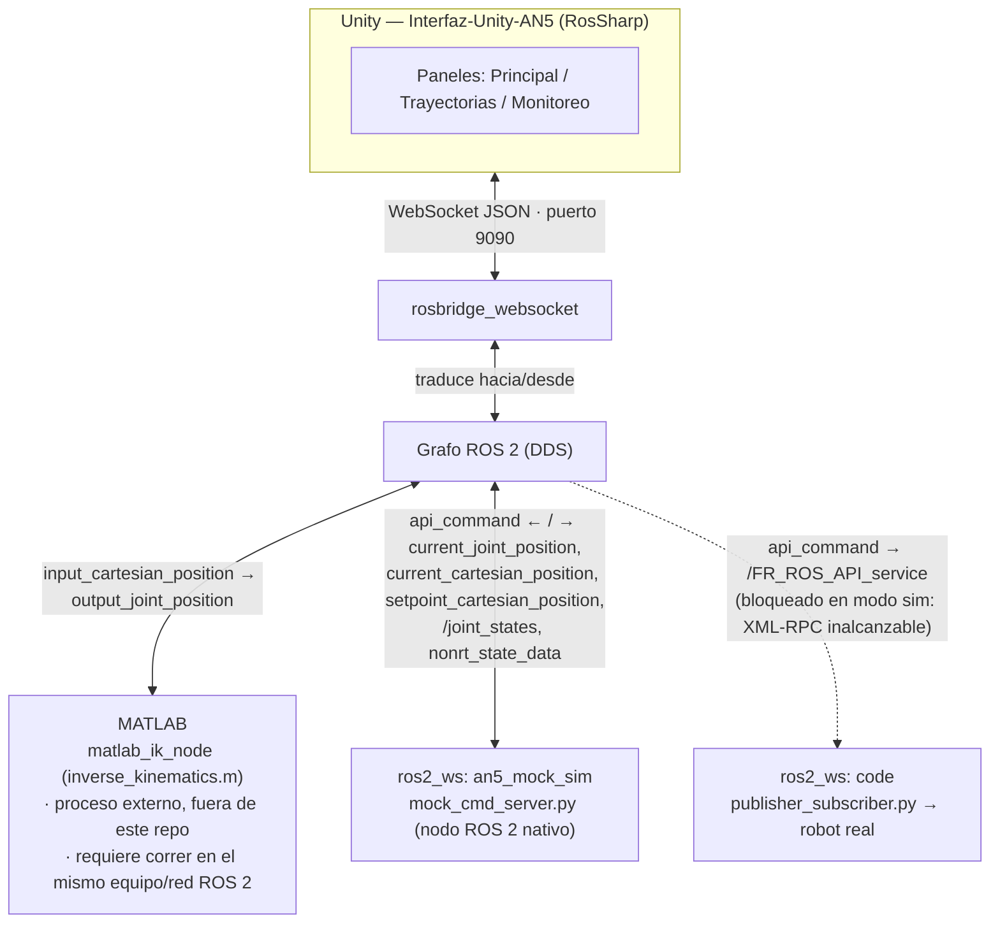

# Project_AN5 — Interfaz Unity + ROS 2 + MATLAB para el brazo AN5/FR5

Proyecto de control y simulación del brazo colaborativo **AN5/FR5v6 (Fairino, 6 DOF)**,
desarrollado en la Universidad del Cauca (grupo GIA). Une en un solo repositorio los
dos componentes que antes vivían en repos separados:

| Carpeta | Qué es | README propio |
|---|---|---|
| [`AN5_workstation/`](AN5_workstation/) | Interfaz de operador en Unity: control articular/cartesiano, grabación y reproducción de trayectorias, visualización 3D del URDF en tiempo real. | [`AN5_workstation/README.md`](AN5_workstation/README.md) |
| [`ros2_ws/`](ros2_ws/) | Workspace ROS 2 del robot, con modo real (driver Fairino) y modo **mock** (simulación sin brazo físico) para desarrollar contra Unity sin hardware. | [`ros2_ws/README.md`](ros2_ws/README.md), detalle del mock en [`ros2_ws/src/an5_mock_sim/README.md`](ros2_ws/src/an5_mock_sim/README.md) |

Antes eran los repos `Interfaz-Unity-AN5` y `ros2_ws` en GitHub; este repo unificado
arrancó con un commit inicial "de cero" (sin arrastrar ese historial) para que ambos
lados del proyecto se versionen juntos de acá en adelante.

## Qué está implementado

**Panel Principal** (control en vivo)
- Control articular de los 6 ejes (BASE, SHOULDER, ELBOW, WRIST 1/2/3) con sliders y
  lectura en grados en tiempo real.
- Lectura cartesiana (X, Y, Z, Rx, Ry, Rz) del robot vía ROS 2.
- Seguimiento del efector final (`j6_link`) en el mundo 3D.

**Panel Trayectorias** (cola de puntos y archivos)
- Captura de la configuración articular actual como waypoint, armado de una secuencia,
  previsualización cartesiana de cada punto (vía IK) y envío de la cola completa como
  trayectoria spline.
- Carga y ejecución de archivos de trayectoria en texto plano (`x,y,z,rx,ry,rz,speed,delay`
  por línea), con pausa/stop/progreso.
- Jog cartesiano: entrada manual de X/Y/Z/Rx/Ry/Rz que resuelve la cinemática inversa
  contra el puente ROS/MATLAB y aplica el resultado a los joints.
- Exportación de la cola actual a un `.txt` con marca de tiempo en `routines/`.

**Panel Monitoreo** (visualización)
- Modelo URDF del FR5v6 animado en tiempo real a partir de los datos articulares
  entrantes.
- Multi-cámara (teclas 1/2/3), órbita/pan (WASD + drag, flechas + click derecho) y zoom.
- Grabador de pantalla del Game View a AVI Motion-JPEG.

**Simulación ROS 2 (`an5_mock_sim`)**
- Reemplaza al driver real (`ros2_cmd_server`) sin tocarlo: mismo servicio
  (`/FR_ROS_API_service`), misma gramática de comandos (`JNTPoint`, `MoveJ`, `MoveL`,
  `SplineStart/SplinePTP/SplineEnd`, `GET`, `StopMotion`, etc.).
- Interpola el movimiento articular (50 Hz por defecto, easing configurable) y calcula
  la pose cartesiana por cinemática **directa** a partir del URDF.
- Publica `/joint_states`, `nonrt_state_data`, y los tópicos CSV que Unity realmente
  consume (`current_joint_position`, `current_cartesian_position`,
  `setpoint_cartesian_position`).
- Permite alternar modo real/simulado sin cambiar nada en Unity (mismo
  `rosbridge_websocket:9090` en ambos casos).

## Arquitectura: cómo se conectan Unity, ROS 2 y MATLAB



Puntos clave:

- **Unity nunca se conecta directo a MATLAB.** Unity solo habla con
  `rosbridge_websocket` (puerto 9090); MATLAB se conecta al grafo ROS 2 como nodo
  nativo (DDS). Ambos comparten tópicos, no una conexión punto a punto — por eso
  **MATLAB tiene que correr en el mismo equipo (o la misma red/dominio ROS 2)** que
  `mock_cmd_server`/`rosbridge_websocket`, no en la máquina donde corre Unity.
- **La cinemática inversa la resuelve MATLAB**, no Unity: se evaluó moverla a Unity
  (`RobotKinematics.MgiAn5`, con límites articulares, colisión y reglas de seguridad
  portadas de `inverse_kinematics.m`) pero la solución de MATLAB resultó más confiable
  en producción, así que sigue siendo la vía activa
  (`input_cartesian_position` → `output_joint_position`).
- **La simulación de movimiento la resuelve `mock_cmd_server`** (ROS 2 nativo, sin
  MATLAB ni robot real): recibe comandos por `api_command` y devuelve el estado
  articular/cartesiano que Unity anima.
- El puente al robot real (`publisher_subscriber.py`) queda inactivo en modo
  simulación porque su XML-RPC al controlador físico nunca responde.

## Requisitos

### Unity (`AN5_workstation/`)
- Unity 6 (o la versión con la que se abrió el proyecto).
- Linux: drivers Vulkan (`libvulkan1 mesa-vulkan-drivers` o el driver NVIDIA) y
  `zenity` o `kdialog` (selector de archivos del panel Trayectorias).
- Windows/macOS: sin dependencias extra (usan PowerShell+WinForms / `osascript`).
- Ver [`AN5_workstation/README.md`](AN5_workstation/README.md) para el detalle completo.

### ROS 2 (`ros2_ws/`)
- Ubuntu 24.04 + ROS 2 **Jazzy** (probado), o Ubuntu 22.04 + **Humble** (compatible,
  cambia solo el paquete apt de rosbridge).
- Alternativa sin instalar ROS 2 en el host: **Docker** (`docker compose up --build`
  dentro de `ros2_ws/`), ver su README.
- No requiere el robot físico para el modo simulado (`sim.launch.py`); el modo real
  (`real.launch.py`) sí necesita el controlador FR5/AN5 accesible en la red.

### MATLAB (externo, no versionado en este repo)
- `matlab_ik_node` (`inverse_kinematics.m`) resuelve la cinemática inversa. No hay
  archivos `.m` en este repo: es un proceso aparte que se conecta al mismo grafo ROS 2.
- Tiene que correr en el mismo equipo (o red/dominio ROS 2) que `ros2_ws`. Trae reglas
  de seguridad propias (caja de posición segura, banda de orientación prohibida en Rx
  y restricción J4/J5) heredadas de otra celda de robot — pueden rechazar poses
  legítimas de este proyecto; ver la nota en
  [`ros2_ws/src/an5_mock_sim/README.md`](ros2_ws/src/an5_mock_sim/README.md).

### Git LFS
Este repo usa **Git LFS** para modelos 3D, texturas, audio/video y otros binarios
pesados (`.gitattributes` en la raíz y en `AN5_workstation/`). Instalalo **antes** de
clonar:

```bash
sudo apt install git-lfs      # o el instalador de tu SO
git lfs install
git clone git@github.com:MooZ91/Project_AN5.git
```

Si ya clonaste sin tener `git-lfs` instalado, los archivos grandes van a aparecer
como punteros de texto en vez de contenido real — corré `git lfs install && git lfs pull`
para traerlos. Esto es lo que suele romper Unity al portar el proyecto a otra máquina:
si los meshes/texturas quedan como punteros, el importer tira una catarata de errores
inconexos en la consola. `AN5_workstation/` trae un chequeo automático para esto (ver
[`AN5_workstation/README.md`](AN5_workstation/README.md#git-lfs)): al abrir el proyecto
detecta punteros sin traer y ofrece correr `git lfs pull` por vos.

## Puesta en marcha rápida

```bash
# 1. Clonar (con Git LFS ya instalado, ver arriba)
git clone git@github.com:MooZ91/Project_AN5.git
cd Project_AN5

# 2. Compilar y levantar el modo simulado de ROS 2
cd ros2_ws
rosdep install --from-paths src --ignore-src -r -y
colcon build --packages-select frhal_msgs code an5_mock_sim
source install/setup.bash
ros2 launch an5_mock_sim sim.launch.py

# 3. (Opcional, para IK) levantar matlab_ik_node en el mismo equipo/red ROS 2

# 4. Abrir AN5_workstation/ en Unity y entrar en Play mode
#    (se conecta solo a rosbridge_websocket:9090)
```

## Notas conocidas

- No corrás `sim.launch.py` y `real.launch.py` al mismo tiempo: compiten por el mismo
  servicio y los mismos tópicos de estado.
- El mock (`mock_cmd_server.py`) simula movimiento e IK propios simplificados
  (sin colisión real, sin distinguir forma de trayectoria entre `MoveJ`/`MoveL`); no
  reemplaza la validación de MATLAB ni del controlador real.
- Hay un lazo interno de Unity, separado de MATLAB, para cinemática **directa**
  (`input_joint_position → output_cartesian_position`, `MGD_Node.cs`/`MGD_Subscriber.cs`);
  tenía una condición de carrera, hoy mitigada calculando la FK localmente en C#
  (`LocalForwardKinematics.cs`) sin round-trip por ROS.

## Licencia

`ros2_ws/` se distribuye bajo Apache License 2.0 (ver [`ros2_ws/LICENSE`](ros2_ws/LICENSE));
incluye contenido de terceros (Fair Innovation, `frcobot_description`) también Apache 2.0.
`AN5_workstation/` no trae licencia propia declarada — revisar antes de redistribuir.
